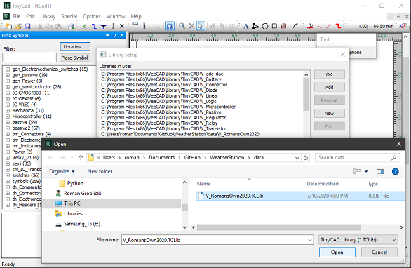
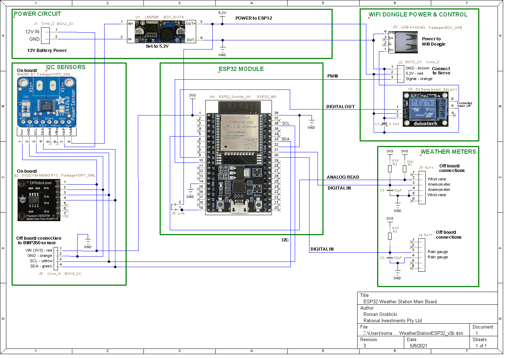
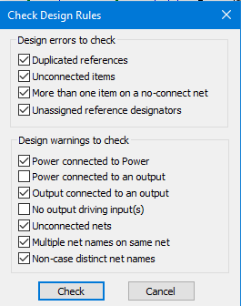
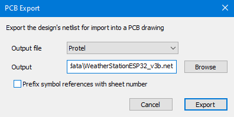
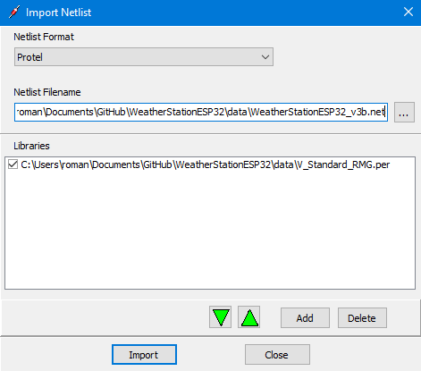

# WeatherStationESP32

## Contents

- [Summary](#Summary)
- [Setup ESP32](#Setup-ESP32)
- [Setup WIFI interface](#Setup-WIFI-interface)
- [Design circuit board](#Design-circuit-board)
  - [Install TinyCAD](#Install-TinyCAD)
  - [Install VeeCAD](#Install-VeeCAD)
- [Assemble weather station](#Assemble-weather-station)
  - [Build circuit board](#Build-circuit-board)
  - [Assemble electronics](#Assemble-electronics)
  - [Attach BME280 sensors](#Attach-BME280-sensor)
  - [Attach wind and rain gauges](#Attach-wind-and-rain-gauges)
  - [Attach power](#Attach-power)  
- [Use weather station](#Use-weather-station)
  - [Access WIFI interface](#Access-WIFI-interface)
  - [Access Bluetooth interface](#Access-Bluetooth-interface)
  - [Automate data collection](#Automate-data-collection)
- [List of parts](#List-of-parts)
  - [Core components](#Core-components)
  - [Connectors](#Connectors)
  - [External components](#External-components)

## Summary

Weather Station based on a ESP32 board using MQTT.

This document describes the design, building and programming of an IOT enabled weather station. At regular intervals (eg. every 15 minutes) it measures a range of weather and other statistics, saving them as time stamped rows to an updated csv file. In particular:

1. Temperature (C)
1. Pressure (HPa)
1. Humidity (%)
1. Rainfall (mm/h)
1. Wind speed (km/h)
1. Wind direction (deg)
1. RTC temp (C)
1. Current (A) - being drawn from the solar panel charged battery
1. Voltage (V) - at the inputs to the circuits voltage regulator
1. Power (W) - drawn by the weather station (as A*V above)

This data can be remotely accessed via MQTT, which also enables add-hoc contol and data requests. Bluetooth control is also implemented.

The hardware is based around an ESP32 module on a small Vero strip board that contains the Voltage Regulator and all other circuits. Everything is powered by a 12V 100Ah AGM Deep Cycle Battery which is charged by a 12V 150W Solar panel via a PWM Solar charge controller. The 12V input is regulated to 5.2V. This is used as required for charging the wifi modem, powering the ESP32 module, servos and the digital relay. The BME280 and INA260 I2C 3.3V sensors are powered via the ESP32.

## Setup ESP32

We are using the ESPRESSIF ESP32-WROOM-32E board. Here we describe the software running on this board.

## Setup WIFI interface

To access the weather station we are using MQTT via a Python GUI app on a PC running Windows 10. Here we describe this software.

## Design circuit board

### Install TinyCAD

[**DOWNLOAD**](https://www.tinycad.net/Home/Download) and install TinyCAD if you don't already have it.

In addition we need the following files. They can reside in any directories (on the PC where TinyCAD is installed) when copied from here or recreated.

| File | Description |
| --- | --- |
| [V_RomansOwn2020.TCLib](data/V_RomansOwn2020.TCLib) | TinyCAD library file with needed custom symbols |
| [WeatherStationESP32_v3b.dsn](data/WeatherStationESP32_v3b.dsn) | Actual TinyCAD file for this projects circuit board |
| [WeatherStationESP32_v3b.net](data/WeatherStationESP32_v3b.net) | PCB netlist created in Protel format from above file |

Now install the above custom symbol library **V_RomansOwn2020.TCLib** from the main menu of TinyCAD: **Library=>Libraries..=>Add=>V_RomansOwn2020.TCLib=>Open=>Ok**

Finally we assume that all the generic TinyCAD and VeeCAD symbols libraries are installed and now we can open and view **WeatherStationESP32_v3b.dsn** with TinyCAD:

With the above *.dsn file loaded we can check and recreate (if we want to) the Protel netlist file **WeatherStationESP32_v3b.net** (mentioned above). To avoid warnings filter the checking options as follows:

Use **Special=>Create PCB Net List...=>Export**

### Install VeeCAD

[**DOWNLOAD**](https://veecad.com/downloads.html) and install VeeCAD if you don't already have it.

In addition we need the following files. They can reside in any directories (on the PC where VeeCAD is installed) when copied from here.

| File | Description |
| --- | --- |
| [V_Standard_RMG.per](data/V_Standard_RMG.per) | Custom VeeCAD shape library file |
| [WeatherStationMain1.per](data/WeatherStationMain1.per) | Vero Board circuit layout file |

Our ultimate goal is to have a valid circuit layout file to help us build the hardware. To view it we just need to open **WeatherStationMain1.per** in VeeCAD.

We can also modify or recreate it by pressing: **Netlist=>Import=>Import** with **WeatherStationMain1.per** open and dialog set to:

