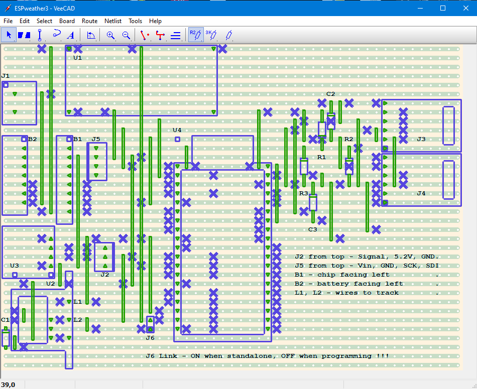

# WeatherStationESP32

## Contents

- [Summary](#Summary)
- [Setup ESP32](#Setup-ESP32)
- [Setup WIFI interface](#Setup-WIFI-interface)
- [Design circuit board](#Design-circuit-board)
  - [Install TinyCAD](#Install-TinyCAD)
  - [Install VeeCAD](#Install-VeeCAD)
- [Assemble weather station](#Assemble-weather-station)
  - [Build circuit board](#Build-circuit-board)
  - [Assemble electronics](#Assemble-electronics)
  - [Attach BME280 sensors](#Attach-BME280-sensor)
  - [Attach wind and rain gauges](#Attach-wind-and-rain-gauges)
  - [Attach power](#Attach-power)  
- [Use weather station](#Use-weather-station)
  - [Access WIFI interface](#Access-WIFI-interface)
  - [Access Bluetooth interface](#Access-Bluetooth-interface)
  - [Automate data collection](#Automate-data-collection)
- [List of parts](#List-of-parts)
  - [Core components](#Core-components)
  - [Connectors](#Connectors)
  - [External components](#External-components)

## Summary

Weather Station based on a ESP32 board using MQTT.

This document describes the design, building and programming of an IOT enabled weather station. At regular intervals (eg. every 15 minutes) it measures a range of weather and other statistics, saving them as time stamped rows to an updated csv file. In particular:

1. Temperature (C)
1. Pressure (HPa)
1. Humidity (%)
1. Rainfall (mm/h)
1. Wind speed (km/h)
1. Wind direction (deg)
1. RTC temp (C)
1. Current (A) - being drawn from the solar panel charged battery
1. Voltage (V) - at the inputs to the circuits voltage regulator
1. Power (W) - drawn by the weather station (as A*V above)

This data can be remotely accessed via MQTT, which also enables add-hoc contol and data requests. Bluetooth control is also implemented.

The hardware is based around an ESP32 module on a small Vero strip board that contains the Voltage Regulator and all other circuits. Everything is powered by a 12V 100Ah AGM Deep Cycle Battery which is charged by a 12V 150W Solar panel via a PWM Solar charge controller. The 12V input is regulated to 5.2V. This is used as required for charging the wifi modem, powering the ESP32 module, servos and the digital relay. The BME280 and INA260 I2C 3.3V sensors are powered via the ESP32.

## Setup ESP32

We are using the ESPRESSIF ESP32-WROOM-32E board. Here we describe the software running on this board.

## Setup WIFI interface

To access the weather station we are using MQTT via a Python GUI app on a PC running Windows 10. Here we describe this software.

## Design circuit board

### Install TinyCAD

[**DOWNLOAD**](https://www.tinycad.net/Home/Download) and install TinyCAD if you don't already have it.

In addition we need the following files. They can reside in any directories (on the PC where TinyCAD is installed) when copied from here or recreated.

| File | Description |
| --- | --- |
| [V_RomansOwn2020.TCLib](data/V_RomansOwn2020.TCLib) | TinyCAD library file with needed custom symbols |
| [WeatherStationESP32_v3b.dsn](data/WeatherStationESP32_v3b.dsn) | Actual TinyCAD file for this projects circuit board |
| [WeatherStationESP32_v3b.net](data/WeatherStationESP32_v3b.net) | PCB netlist created in Protel format from above file |

Now install the above custom symbol library **V_RomansOwn2020.TCLib** from the main menu of TinyCAD: **Library=>Libraries..=>Add=>V_RomansOwn2020.TCLib=>Open=>Ok**

Finally we assume that all the generic TinyCAD and VeeCAD symbols libraries are installed and now we can open and view **WeatherStationESP32_v3b.dsn** with TinyCAD:

With the above *.dsn file loaded we can check and recreate (if we want to) the Protel netlist file **WeatherStationESP32_v3b.net** (mentioned above). To avoid warnings filter the checking options as follows:

Use **Special=>Create PCB Net List...=>Export**

### Install VeeCAD

[**DOWNLOAD**](https://veecad.com/downloads.html) and install VeeCAD if you don't already have it.

In addition we need the following files. They can reside in any directories (on the PC where VeeCAD is installed) when copied from here.

| File | Description |
| --- | --- |
| [V_Standard_RMG.per](data/V_Standard_RMG.per) | Custom VeeCAD shape library file |
| [ESPweather3.per](data/ESPweather3.per) | Vero Board circuit layout file |

Our ultimate goal is to have a valid circuit layout file to help us build the hardware. To view it we just need to open **ESPweather3.per** in VeeCAD.

We can also modify or recreate it by pressing: **Netlist=>Import=>Import** with **ESPweather3.per** open and dialog set to:

## List of parts
  
### Core components

| Qty | Product | Description | AUD Cost | Comment | Designator____ |
| --- | --- | --- | --- | --- | --- |
|1 | [CE05971](https://core-electronics.com.au/raspberry-pi-3-model-a-plus.html) | Raspberry Pi 3 Model A+ | $44.51 | Used for internet connection/control and storing collected data | connected to J2 and J8. Also camera attached |
|1 | [A000052](https://core-electronics.com.au/arduino-leonardo-without-headers.html) | Arduino Leonardo (Without Headers) | $39.00 | Used to interface all sensors | connected to J3, J5, J6 and J9 |
|1 | [XC4514](https://jaycar.com.au/p/XC4514) | Arduino Compatible DC Voltage Regulator | $7.95 | Converts 12V battery power to 5.2V for all weather station needs. Use 4 pins from 40 Pin Header Terminal Strip to attach its corners to Vero board | U1 |
|1 | [ADA4226](https://core-electronics.com.au/adafruit-ina260-high-or-low-side-voltage-current-power-sensor.html) | Adafruit INA260 High or Low Side Voltage, Current, Power Sensor | $22.51 | measures power and voltage used by total circuit. Attach to Vero board using supplied 8 Pin Header Terminal Strip | B2 |
|1 | [ADA2652](https://core-electronics.com.au/adafruit-bme280-i2c-or-spi-temperature-humidity-pressure-sensor.html) | Adafruit BME280 I2C or SPI Temperature Humidity Pressure Sensor | $45.02 | off board sensor used in shielded I2C mode | connected to J7 |
|1 | [SEN-15901](https://core-electronics.com.au/weather-meter-kit.html) | Weather Meter Kit | $144.80 | passive reed switch based wind speed, direction and rain sensors | connected to J10 and J11 |
|2 | [BOB-14021](https://core-electronics.com.au/sparkfun-rj11-breakout.html) | SparkFun RJ11 Breakout | $2.95 | contains below RJ11 Connector. Attach to Vero board using a 6 Pin Header Terminal Strip | J10 |
|2 | [PRT-00132](https://core-electronics.com.au/rj11-6-pin-connector.html) | RJ11 6-Pin Connector | $3.78 | attaches to above breakout board | |
|1 | [SY4058](https://jaycar.com.au/p/SY4058) | 6V DIL SPDT Mini Relay | $7.95 | used to control charging of Wifi Modem | U2 |
|1 | [YM2758](https://jaycar.com.au/p/YM2758) | Arduino Compatible 9G Micro Servo Motor | $11.95 | used to "manually" reset Wifi Modem, connect with three 2M lengths of hookup wire | connected to J4 |
|1 | [RR0596](https://jaycar.com.au/p/RR0596) | 10k Ohm 0.5 Watt Metal Film Resistors - Pack of 8 ( only need 3 )| $0.85 | part of hardware debounce and input circuit for Weather Meter Kit sensors | R3, R5, R6 |
|1 | [RR0572](https://jaycar.com.au/p/RR0572) | 1k Ohm 0.5 Watt Metal Film Resistors - Pack of 8 ( only need 3 ) | $0.85 | used in hardware debounce and relay circuits | R1, R2, R4 |
|1 | [ZT2152](https://jaycar.com.au/p/ZT2152) | BC547 NPN Transistor | $0.30 | used in relay circuit | Q1 |
|1 | [ZR1004](https://jaycar.com.au/p/ZR1004) | 1N4004 1A 400V Diode - Pack of 4 ( only need 1 )| $0.98 | used in relay circuit | D1 |
|2 | [MCCB](https://au.element14.com/multicomp/mccb1v104m2acb/cap-0-1-f-35v-20/dp/9708480) | Tantalum Capacitor, 0.1 µF, 35 V, MCCB Series, ± 20%, Radial Leaded, 5.08 mm | $4.34 | used in hardware debounce circuit for wind speed and rain sensors | C1, C2 |

### Connectors

| Qty | Product | Description | AUD Cost | Comment | Designator____ |
| --- | --- | --- | --- | --- | --- |
|1 | [HP9544](https://jaycar.com.au/p/HP9544) | PC Boards Vero Type Strip - 95mm x 305mm| $12.95 | Contains all circuits apart from Raspberry Pi and Arduino |
|1 | [WW4030](https://jaycar.com.au/p/WW4030) | Tinned Copper Wire - 100 gram Roll | $19.95 | for wiring up above Vero board |
|5 | [HM3414](https://jaycar.com.au/p/HM3414) | 4 Pin 0.1 Straight Locking Header - 2.54 pitch - Single | $2.00 | On Vero board to connect to Raspberry Pi, Arduino and BMP280 sensor | J2, J3, J7, J9 |
|6 | [HM3412](https://jaycar.com.au/p/HM3412) | 2 Pin 0.1 Straight Locking Header - 2.54 pitch - Single | $2.40 | On Vero board and Arduino for interconnection | J5, J6, J8 |
|1 | [HM3413](https://jaycar.com.au/p/HM3413) | 3 Pin 0.1 Straight Locking Header - 2.54 pitch - Single | $0.40 | On Arduino for connection to Vero board circuit |
|3 | [HM3172](https://jaycar.com.au/p/HM3172) | 2 Way PCB Mount Screw Terminals 5mm Pitch | $4.05 | On Vero board for external connections to 12V power, Raspberry Pi and wind direction sensor | J1, J11, J12 |
|1 | [HM3173](https://jaycar.com.au/p/HM3173) | 3 Way PCB Mount Screw Terminal - 5mm Pitch | $1.75 | On Vero board for external connection to Wifi Modem switching servo | J4 |
|1 | [PS0916](https://jaycar.com.au/p/PS0916) | USB TYPE A PC MOUNT Socket | $2.95 | on Vero board for power to Wifi Modem | U3 |
|1 | [HP0924](https://jaycar.com.au/p/HP0924) | M3 x 12mm Tapped Nylon Spacers - Pk.25 ( only need 14 )| $9.95 | For mounting Vero board, Raspberry Pi, Arduino and camera|
|1 | [HP0430](https://jaycar.com.au/p/HP0430) | 3mm Flat Steel Washers - Pk.25 ( only need 12 )| $3.00 | as above |
|1 | [HP0440](https://jaycar.com.au/p/HP0440) | M3 x 5mm Black Equipment Screws - Pk.25 ( only need 14 )| $2.30 | as above |
|1 | [HP0403](https://jaycar.com.au/p/HP0403) | M3 x 10mm Steel Screws - Pk.25 ( only need 12 )| $3.00 | For mounting Vero board, Raspberry Pi and Arduino |
|1 | [HM3212](https://jaycar.com.au/p/HM3212) | 40 Pin Header Terminal Strip ( only need 4 pins ) | $1.10 | for mounting power circuit XC4514 |
|1 | [WC6024](https://jaycar.com.au/p/WC6024) | 150mm Plug to Plug Jumper Leads - 40 Piece ( only need 3 ) | $5.95 | for connecting Vero board circuits to Servo and other external sensors |

### External components

| Qty | Product | Description | AUD Cost | Comment |
| --- | --- | --- | --- | --- |
|1 | [PP1970](https://jaycar.com.au/p/PP1970) | Marine Grade 10A Locking Lighter Plug | $7.95 | Used to get 12V power from Battery Box |
|1 | [WH3057](https://jaycar.com.au/p/WH3057) | 7.5 Amp 2 Core Tinned DC Power Cable -  3 metre | $4.80 | Connects above to main vero circuit board |
|1 | [SB1682](https://jaycar.com.au/p/SB1682) | 12V 100Ah AGM Deep Cycle Battery | $299.0 | stores all power for this weather station  
|1 | [ZM9135](https://jaycar.com.au/p/ZM9135) | 12V 150W Folding Solar Panel with 5M lead (discontinued) | $169.00 | used to charge above battery - has controller |
|1 | [HB8502](https://jaycar.com.au/p/HB8502) | Battery Box with Voltmeter and USB Charge | $99.95 | keeps battery safe and conveniently accessible |
|1 | [WH3000](https://jaycar.com.au/p/WH3000) | Red Light Duty Hook-up Wire - 25m ( only 3 metres needed ) | $5.95 | used for attaching external sensors/servo |
|1 | [WH3001](https://jaycar.com.au/p/WH3001) | Black Light Duty Hook-up Wire - 25m ( only 3 metres needed ) | $5.95 | used for attaching external sensors/servo |
|1 | [WH3004](https://jaycar.com.au/p/WH3004) | Yellow Light Duty Hook-up Wire - 25m ( only 2 metres needed ) | $5.95 | used for attaching external sensors/servo |
|1 | [WB1506](https://jaycar.com.au/p/WB1506) |  FIG 8 - OFC Shielded Audio Cable - Sold per metre - 1 metre )| $4.95 | used for attaching external I2C sensor |
|1 | [WifiModem](https://www.telstra.com.au/internet/mobile-broadband/telstra-4gx-hotspot) | Telstra 4GX Wi-Fi Pro | $120.0 | connects weather station to the internet |
|1 | [COU2AMB02](https://www.officeworks.com.au/shop/officeworks/p/comsol-male-type-a-usb-2-0-to-male-mini-usb-cable-2m-cou2amb02) | USB A to Mini-B 2M Cable | $14.88 | power to above wifi dongle from Vero board power circuit |
